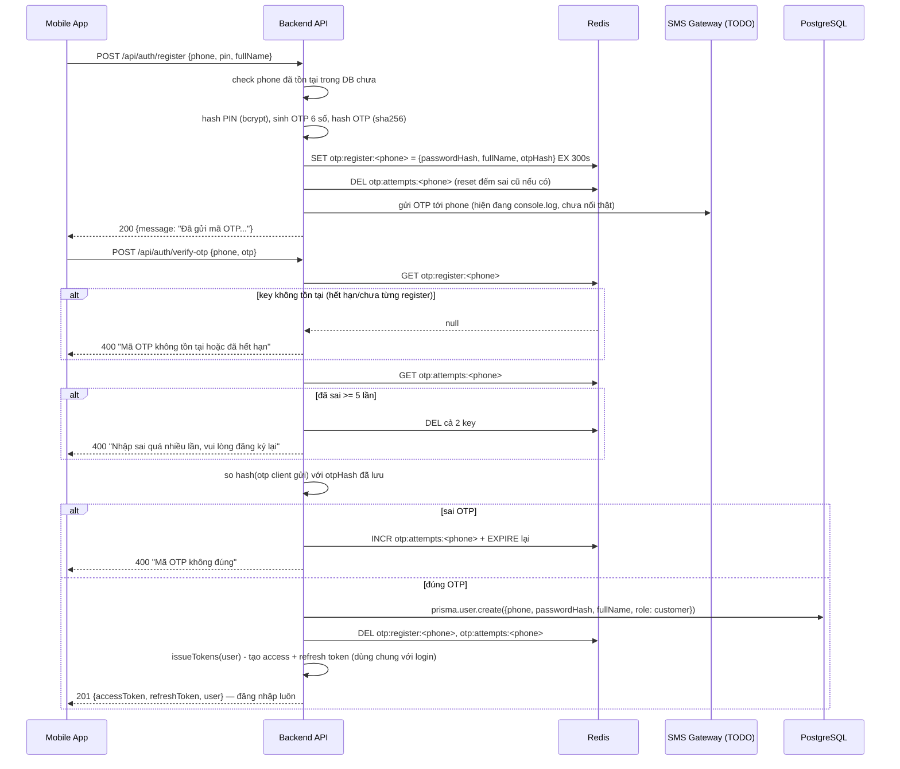

# Luồng xác thực OTP khi đăng ký (customer)

Áp dụng riêng cho `POST /api/auth/register` (customer, `phone + PIN`) — `station_owner` (`email + password`) không qua OTP. Tham chiếu code: `src/controllers/authController.js` (`registerCustomer`, `verifyOtp`), `src/config/redis.js`, `src/routes/auth.routes.js`.

## Vì sao cần OTP

Xác nhận số điện thoại đăng ký là **có thật và đúng chủ** — chống gõ nhầm số, chống tạo tài khoản ảo hàng loạt. User phải chứng minh họ nhận được SMS gửi tới đúng số đó thì tài khoản mới được tạo thật.

## Ý tưởng cốt lõi: chưa tạo `User` ngay

Khác với `registerOwner` (tạo `User` ngay lập tức), `registerCustomer` **không tạo row nào trong bảng `users`** ở bước đầu. Toàn bộ thông tin đăng ký (`phone`, PIN đã hash, OTP đã hash) được lưu **tạm thời trong Redis**, có TTL (tự hết hạn). `User` chỉ thật sự được `prisma.user.create(...)` khi verify đúng OTP.

**Lý do chọn Redis (TTL) thay vì tạo `User` trước rồi thêm cột `phoneVerifiedAt`:**

| | Tạo `User` trước, thêm cột `phoneVerifiedAt` | Lưu tạm ở Redis, tạo `User` sau khi verify (cách đang dùng) |
|---|---|---|
| User bỏ dở giữa chừng (không nhập OTP) | Để lại row "rác" chưa xác thực trong Postgres mãi mãi, phải tự viết job dọn | Redis tự xoá key sau khi hết TTL, không cần dọn tay |
| `phone` unique bị chiếm bởi ai | Ai đăng ký trước (dù chưa xác thực) chiếm số, người khác không đăng ký lại được số đó | `phone` chỉ thật sự "chiếm chỗ" trong Postgres sau khi verify xong |
| Độ phức tạp | Thêm 1 cột, thêm logic check `phoneVerifiedAt IS NULL` ở khắp nơi cần chặn user chưa xác thực | Không đổi schema `users`, logic OTP gói gọn trong 2 hàm |

## Sơ đồ luồng

## Redis key schema

| Key | Value | TTL | Mục đích |
|---|---|---|---|
| `otp:register:<phone>` | JSON `{ passwordHash, fullName, otpHash }` | 300s (5 phút) | Data đăng ký tạm + mã OTP đã hash, chờ verify |
| `otp:attempts:<phone>` | Số nguyên (đếm) | 300s, reset mỗi lần `register` mới | Đếm số lần nhập sai OTP, chặn brute-force |

Cả PIN lẫn OTP đều **không lưu plaintext** — PIN hash bằng `bcrypt` (giống password), OTP hash bằng `sha256` (đủ dùng vì OTP sống ngắn + đã giới hạn số lần thử, không cần thuật toán chậm như bcrypt).

## Các trường hợp lỗi (edge case) đã xử lý

- **Số điện thoại đã có tài khoản** → chặn ngay ở bước `register`, không tốn phí gửi SMS
- **Gọi lại `register` khi chưa verify xong** (vd chưa nhận được SMS, bấm gửi lại) → key Redis cũ bị **ghi đè** bởi OTP mới, kèm reset bộ đếm sai — hoạt động tự nhiên như "gửi lại mã", không cần endpoint resend riêng
- **OTP hết hạn (quá 5 phút)** → `redis.get` trả `null` → bắt đăng ký lại từ đầu
- **Nhập sai OTP** → tăng bộ đếm, cho thử lại, chưa xoá key ngay
- **Sai quá 5 lần** → xoá sạch cả 2 key, bắt đăng ký lại (chống dò 6 số bằng cách thử liên tục trong đúng 1 phiên OTP)
- **Verify xong gọi lại OTP cũ** → key đã bị xoá ngay sau khi tạo `User` thành công → báo "hết hạn", không tạo trùng

## Giới hạn hiện tại / việc cần làm tiếp

- **Gửi SMS đang là giả lập** (`console.log` trong `registerCustomer`) — cần thay bằng gọi API nhà cung cấp SMS thật (eSMS/SpeedSMS/Twilio...) khi chọn được vendor, xem phần bàn chi phí trong lịch sử trao đổi
- **Rate-limit theo IP** (`express-rate-limit`, route `/register` và `/verify-otp`) đã có, nhưng đây là lớp chặn *ngoài*, khác với bộ đếm `otp:attempts:<phone>` (chặn *theo số điện thoại cụ thể*) — cả 2 cùng hoạt động song song, không thay thế nhau
- Chưa có endpoint `resend-otp` riêng — hiện đang tận dụng gọi lại `register` để có tác dụng tương tự, nếu sau này cần UX rõ ràng hơn (nút "Gửi lại mã" riêng, đếm ngược khác) có thể tách endpoint riêng
