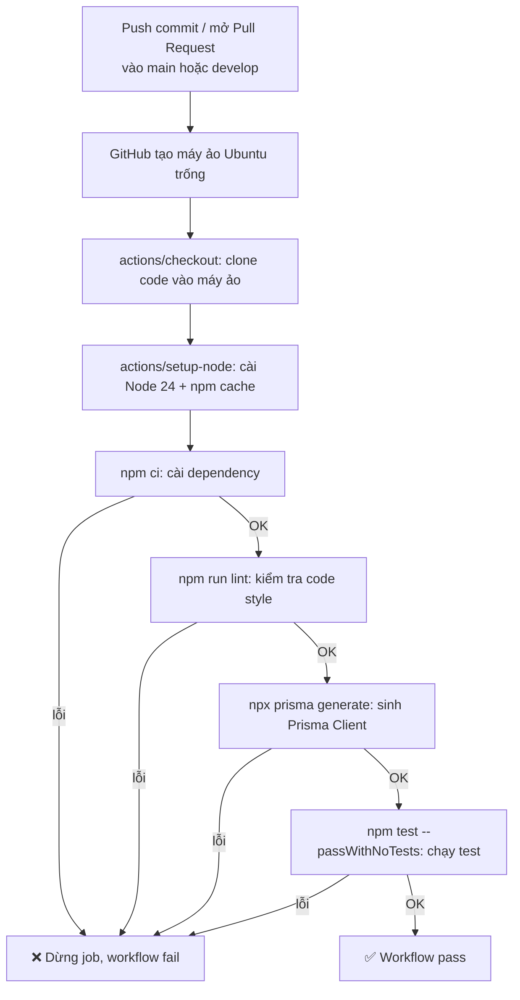

# CI/CD Workflow

Tham chiếu code: [.github/workflows/ci.yml](../.github/workflows/ci.yml). Xem thêm [CICD_And_DevOps_Pipeline.md](../../CICD_And_DevOps_Pipeline.md) (tài liệu gốc, kế hoạch đầy đủ cho cả staging/production — file này chỉ mô tả phần **đã thực sự triển khai**: CI cơ bản cho `backend/`).

## CI là gì

**CI (Continuous Integration)** — mỗi khi có người `push` code hoặc mở Pull Request, 1 hệ thống tự động (ở đây là GitHub Actions) **tự chạy 1 loạt bước kiểm tra** (cài dependency, lint, build, test...) trên đúng bản code vừa gửi lên — không cần ai tự chạy tay trên máy mình.

**Mục đích cốt lõi:** phát hiện lỗi **càng sớm càng tốt**, ngay tại thời điểm code được gửi lên, thay vì để lỗi lọt vào nhánh chính (`main`) rồi mới phát hiện — hoặc tệ hơn, phát hiện sau khi đã deploy lên production.

## CD là gì

**CD** có 2 cách hiểu, thường đi liền nhau:
- **Continuous Delivery** — code sau khi qua CI (pass hết kiểm tra) được **tự động đóng gói sẵn sàng deploy** (vd build Docker image, đẩy lên registry), nhưng bước **deploy thật** vẫn cần người bấm nút xác nhận (thường dùng cho production, để có bước duyệt thủ công).
- **Continuous Deployment** — code pass CI thì **tự động deploy thẳng** lên server (staging/production), không cần ai bấm gì thêm.

Trong tài liệu gốc [CICD_And_DevOps_Pipeline.md](../../CICD_And_DevOps_Pipeline.md), dự án dự định dùng **Continuous Delivery cho staging** (tự deploy) + **duyệt thủ công cho production**.

## Vì sao cần cả CI lẫn CD

| Không có CI/CD | Có CI/CD |
|---|---|
| Mỗi người tự chạy test/lint trên máy mình — dễ quên, dễ bỏ sót | Server trung lập tự chạy, không phụ thuộc ai có nhớ chạy hay không |
| Lỗi phát hiện muộn (sau khi merge, thậm chí sau khi deploy) | Lỗi phát hiện ngay lúc push/mở PR, trước khi merge |
| Deploy thủ công — dễ quên bước, dễ deploy nhầm version | Deploy tự động theo đúng quy trình cố định, giảm lỗi con người |
| Review PR khó biết code có chạy được không nếu chỉ đọc diff | PR tự hiện kết quả ✅/❌ ngay trên GitHub, review dựa trên cả kết quả kiểm tra thật |

## Trạng thái hiện tại của dự án

- ✅ **CI cơ bản đã setup** cho `backend/` — chạy lint + `prisma generate` + test mỗi khi push/PR vào `main`/`develop`
- ❌ **CD chưa làm** — chưa có `Dockerfile` cho app, chưa có server thật để deploy, chưa có staging/production environment. Đây là việc làm sau, khi có nhiều tính năng hơn và cần môi trường thật để test tay

## Chi tiết `ci.yml` — giải thích từng dòng

```yaml
name: CI

on:
  push:
    branches: [main, develop]
  pull_request:
    branches: [main, develop]

jobs:
  build:
    runs-on: ubuntu-latest
    defaults:
      run:
        working-directory: backend

    steps:
      - uses: actions/checkout@v4

      - uses: actions/setup-node@v4
        with:
          node-version: 24
          cache: 'npm'
          cache-dependency-path: backend/package-lock.json

      - run: npm ci
      - run: npm run lint
      - run: npx prisma generate
      - run: npm test -- --passWithNoTests
```

### `name: CI`

Tên hiển thị của workflow trên tab **Actions** của GitHub — chỉ để phân biệt khi có nhiều workflow khác nhau sau này (vd `deploy-staging.yml`). Không ảnh hưởng logic chạy.

### `on:` — khi nào workflow được kích hoạt

```yaml
on:
  push:
    branches: [main, develop]
  pull_request:
    branches: [main, develop]
```

- `push` + `branches: [main, develop]` — chạy khi có ai **push thẳng** commit vào 1 trong 2 nhánh này (push vào nhánh khác, vd `feature/xyz`, **không** kích hoạt).
- `pull_request` + `branches: [main, develop]` — chạy khi có ai **mở/cập nhật Pull Request nhắm tới** (target) 1 trong 2 nhánh này (vd PR từ `develop` → `main`).

**Tác dụng thực tế:** khớp đúng quy trình `develop` → review → merge `main` đang dùng — khi mở PR từ `develop` vào `main`, CI tự chạy ngay trên PR, thấy kết quả pass/fail **trước khi** bấm Merge.

### `jobs:` — định nghĩa công việc

```yaml
jobs:
  build:
    runs-on: ubuntu-latest
    defaults:
      run:
        working-directory: backend
```

- `jobs:` — 1 workflow có thể có nhiều **job**, chạy song song hoặc tuần tự. Ở đây chỉ 1 job tên `build` (tên tự đặt, không phải từ khoá bắt buộc).
- `runs-on: ubuntu-latest` — GitHub thuê tạm 1 **máy ảo Linux Ubuntu, hoàn toàn trống** để chạy các bước bên dưới — không có Node, không có code sẵn, mỗi lần chạy là 1 máy mới.
- `defaults.run.working-directory: backend` — mọi lệnh `run` bên dưới mặc định chạy **bên trong thư mục `backend/`** — cần thiết vì `package.json` nằm trong đó, không phải ở gốc repo.

### Bước 1 — Lấy code về máy ảo

```yaml
- uses: actions/checkout@v4
```

`uses:` (khác `run:`) nghĩa là dùng lại 1 **action có sẵn** do người khác viết, đóng gói thành 1 đơn vị dùng lại được — ở đây là action chính thức `actions/checkout`, phiên bản `v4`. Việc nó làm: **clone code của repo vào máy ảo**. Không có bước này, các bước sau không thấy `package.json`, `src/`... vì máy ảo ban đầu trống trơn.

### Bước 2 — Cài Node.js

```yaml
- uses: actions/setup-node@v4
  with:
    node-version: 24
    cache: 'npm'
    cache-dependency-path: backend/package-lock.json
```

- `actions/setup-node@v4` — action cài Node.js lên máy ảo. **Lưu ý cú pháp:** phải ghi `@v4` (có chữ `v`) vì GitHub Actions xác định version qua **tag Git** của repo action, và `actions/setup-node` đặt tag dạng `v4`/`v3`, không phải `4` trơn — ghi sai (`@4`) sẽ báo lỗi "unable to resolve action" ngay bước này.
- `with:` — tham số truyền cho action:
  - `node-version: 24` — cài đúng Node 24, khớp `.nvmrc` dùng khi dev local — tránh lệch version giữa máy dev và CI (bài học từ vụ Prisma 7 không chạy được trên Node 16 trước đó).
  - `cache: 'npm'` — bật cache cho npm, lần chạy sau không phải tải lại toàn bộ dependency từ đầu (nhanh hơn).
  - `cache-dependency-path: backend/package-lock.json` — action dựa vào file này để biết cache còn hợp lệ không (đổi `package-lock.json` → cache tự làm mới).

### Các bước chạy lệnh thật

```yaml
- run: npm ci
```
`run:` (khác `uses:`) nghĩa là chạy thẳng 1 lệnh shell. `npm ci` khác `npm install`: cài **chính xác** theo `package-lock.json` (không tự nâng version nào), và **xoá sạch `node_modules` cũ trước khi cài** — đảm bảo môi trường sạch, tái lập y hệt mỗi lần chạy. Đây là lệnh khuyến nghị dùng trong CI thay vì `npm install`.

```yaml
- run: npm run lint
```
Chạy script `lint` trong `package.json` (`eslint src`) — kiểm tra code style/lỗi tiềm ẩn. **Nếu bước này fail, cả job dừng ngay**, các bước sau không chạy — hành vi mặc định của GitHub Actions: 1 step exit code khác 0 thì dừng job, đánh dấu workflow ❌.

```yaml
- run: npx prisma generate
```
Sinh Prisma Client từ `schema.prisma`. Bắt buộc vì `src/config/prisma.js` có `require('../generated/prisma')`, nhưng thư mục đó đã bị `.gitignore` (không commit) — máy ảo CI hoàn toàn mới, chưa có thư mục này, phải tự sinh lại.

```yaml
- run: npm test -- --passWithNoTests
```
Chạy Jest. Dấu `--` là quy ước của `npm`: mọi thứ sau đó truyền thẳng làm tham số cho chương trình thật (`jest`), không phải cho `npm`. Lệnh thật chạy là `jest --passWithNoTests`. Flag này khiến Jest **không báo lỗi** dù tìm thấy 0 file test — cần thiết vì project hiện chưa có file `*.test.js` nào (mặc định Jest coi "không có test" là lỗi).

## Sơ đồ luồng chạy



Bất kỳ bước nào fail → dừng ngay tại đó, các bước sau không chạy, workflow hiện ❌ trên GitHub kèm log chi tiết lỗi ở đúng bước đó.

## Việc cần làm tiếp

- Viết test thật (`*.test.js`) — bỏ dần flag `--passWithNoTests` khi đã có test, để CI thật sự kiểm tra được logic (vd test `authController` với `jest-mock-extended` cho Prisma Client, theo đúng gợi ý trong `.claude/rules/backend.md`)
- Thêm bước chạy Prisma migration test trên DB tạm (service container Postgres trong CI) để verify migration luôn chạy được sạch từ đầu — tránh lặp lại lỗi `uuid_generate_v4()` đã gặp lúc trước
- CD: viết `Dockerfile` cho app, thêm workflow `deploy-staging.yml` khi có server thật để deploy lên
- Thêm `security-scan.yml` (SAST) trước khi launch, theo checklist bảo mật đã ghi trong `CLAUDE.md`
