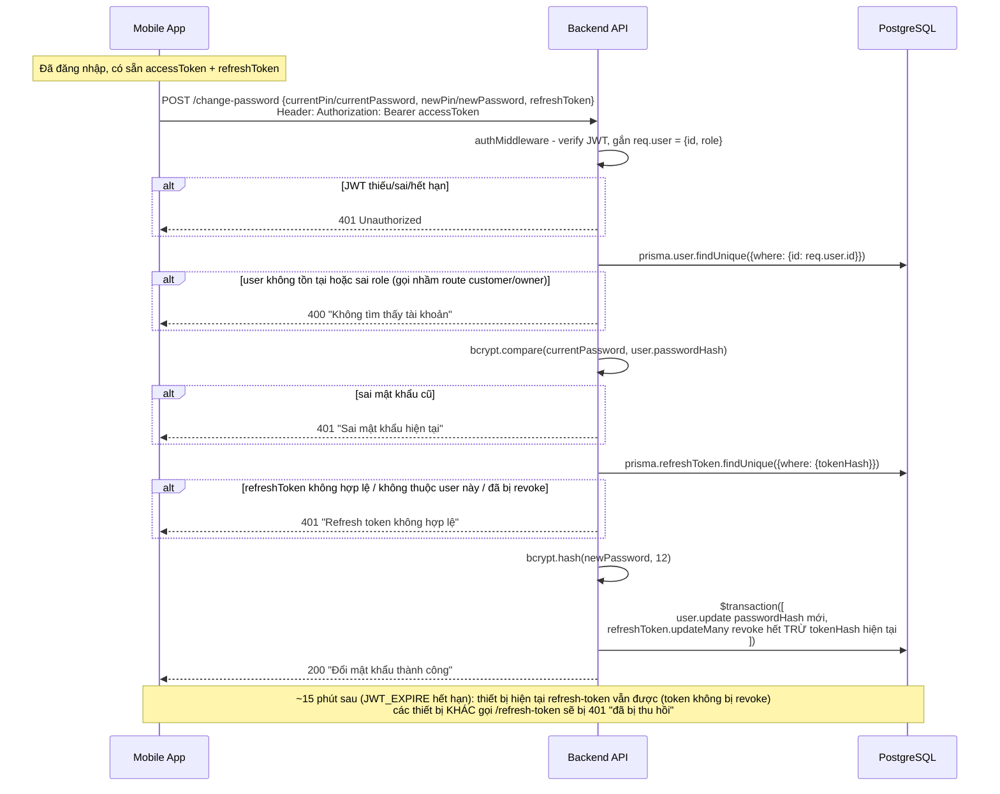

# Luồng đổi mật khẩu khi đang đăng nhập (Change Password)

Áp dụng cho `POST /api/auth/change-password` (customer, đổi PIN) và `POST /api/auth/change-password/owner` (station_owner, đổi password). Tham chiếu code: `src/controllers/authController.js` (`changePasswordHandler` — chỉ orchestration), `src/services/authService.js` (`verifyCredential`, `hashCredential`, `updatePasswordAndRevokeSessions`), `src/services/tokenService.js` (`hashToken`), `src/routes/auth.routes.js`.

## Khác gì với "quên mật khẩu" ([FORGOT_RESET_PASSWORD_FLOW.md](FORGOT_RESET_PASSWORD_FLOW.md))

2 luồng này dễ nhầm vì cùng kết thúc bằng "đổi `passwordHash`", nhưng xuất phát điểm khác hẳn nhau:

| | Quên mật khẩu (forgot/reset) | Đổi mật khẩu (change) |
|---|---|---|
| User đang ở trạng thái nào | **Chưa đăng nhập được** (quên mật khẩu, không có JWT) | **Đang đăng nhập** (có JWT hợp lệ) |
| Cách xác minh "đúng là chủ tài khoản" | OTP gửi qua phone/email (2 bước) | Nhập lại mật khẩu **cũ** (1 bước, không cần OTP) |
| Danh tính lấy từ đâu | `req.body.phone`/`req.body.email` (client tự khai) | `req.user.id` (giải mã từ JWT, không tin `req.body`) |
| Middleware cần | Không cần `authMiddleware` (đang chưa đăng nhập) | **Bắt buộc** `authMiddleware` chạy trước |
| Revoke session sau khi đổi | Revoke **hết** (không có khái niệm "phiên hiện tại" vì vốn chưa đăng nhập) | Revoke hết **trừ phiên hiện tại** (kiểu Facebook — không tự đăng xuất chính mình) |

## Ý tưởng cốt lõi

Vì user đã đăng nhập (đi qua `authMiddleware` trước khi vào controller), không cần OTP — chỉ cần họ **gõ đúng mật khẩu cũ** là đủ bằng chứng "đúng là chủ tài khoản". Đây là lý do hàm này **ngắn hơn hẳn** `resetPasswordHandler` (không có bước sinh/verify OTP qua Redis).

Điểm phức tạp duy nhất nằm ở việc **revoke session mà không tự đăng xuất chính mình**: request đổi mật khẩu mang theo access token (header `Authorization`) chứ không phải refresh token, nên muốn biết "phiên nào đang gọi request này" để loại trừ, client phải **tự gửi kèm `refreshToken`** trong body — server băm ra so với DB để xác nhận đúng là 1 refresh token hợp lệ của chính user này, rồi dùng chính hash đó làm điều kiện loại trừ lúc revoke.

## Sơ đồ luồng



## Chi tiết code

### `changePasswordHandler` (trong `authController.js`)

```js
function changePasswordHandler({ role, currentField, newField }) {
    return async (req, res, next) => {
        const userId = req.user.id;
        const currentPassword = req.body[currentField];
        const newPassword = req.body[newField];
        const { refreshToken } = req.body;
        const tokenHash = hashToken(refreshToken);

        const user = await prisma.user.findUnique({ where: { id: userId } });

        if (!user || user.role !== role) {
            return next(new AppError('Không tìm thấy tài khoản', 400));
        }

        const isValid = await verifyCredential(currentPassword, user.passwordHash);
        if (!isValid) {
            return next(new AppError('Sai mật khẩu hiện tại', 401));
        }

        const currentSession = await prisma.refreshToken.findUnique({ where: { tokenHash } });
        if (!currentSession || currentSession.userId !== userId || currentSession.revokedAt) {
            return next(new AppError('Refresh token không hợp lệ', 401));
        }

        const newPasswordHash = await hashCredential(newPassword);
        await updatePasswordAndRevokeSessions(userId, newPasswordHash, tokenHash);

        res.json({ data: { message: 'Đổi mật khẩu thành công' } });
    };
}

const changePasswordCustomer = changePasswordHandler({ role: UserRole.customer, currentField: 'currentPin', newField: 'newPin' });
const changePasswordOwner = changePasswordHandler({ role: UserRole.station_owner, currentField: 'currentPassword', newField: 'newPassword' });
```

Đi từng bước, kèm lý do:

1. **`const userId = req.user.id;`** — lấy danh tính từ JWT (đã verify + gắn vào `req.user` bởi `authMiddleware` ở tầng route), **không** lấy `userId` từ `req.body`/query param — tránh IDOR (user A gửi `userId` của user B để đổi mật khẩu hộ người khác). Đây là rule bắt buộc trong `backend.md`: "Không tin `user_id` gửi từ client — luôn lấy từ `req.user.id` sau khi verify JWT".

2. **`req.body[currentField]`/`req.body[newField]`** — computed property, đọc field khác nhau tuỳ role (`currentPin`/`newPin` cho customer, `currentPassword`/`newPassword` cho owner) — cùng factory pattern với `resetPasswordHandler`, chỉ khác không cần `identifierField` (đã biết `userId` từ JWT, không cần tự tìm user theo phone/email nữa).

3. **`const tokenHash = hashToken(refreshToken);`** — băm refresh token client gửi kèm để dò trong DB. `hashToken` là hàm dùng chung (từ `tokenService.js`) với `issueTokens`/`refreshTokenHandler`/`logout` — DB không bao giờ lưu refresh token dạng plaintext.

4. **`if (!user || user.role !== role)`** — dù `userId` lấy từ JWT (đáng tin), vẫn check lại `role` cho khớp route đang gọi. Lý do: 1 `station_owner` có JWT hợp lệ vẫn có thể *cố tình* gọi vào route `/change-password` (dành cho customer) — nếu không check, họ có thể lách để đặt mật khẩu chỉ 6 số (theo validate PIN của route customer) thay vì chính sách tối thiểu 8 ký tự áp cho owner.

5. **`bcrypt.compare` qua `verifyCredential`** — xác minh mật khẩu **cũ** đúng không, đây là bước thay thế cho OTP (đã đăng nhập rồi nên không cần xác minh qua kênh khác, chỉ cần chứng minh biết mật khẩu hiện tại).

6. **Bước `prisma.refreshToken.findUnique({ where: { tokenHash } })` + 3 điều kiện `!currentSession || currentSession.userId !== userId || currentSession.revokedAt`** — validate `refreshToken` client gửi lên là **thật sự hợp lệ** trước khi tin nó là "phiên hiện tại": (a) phải tồn tại trong DB, (b) phải đúng thuộc về user này (không phải refresh token của người khác), (c) chưa từng bị revoke từ trước. Thiếu bước này, 1 `refreshToken` sai/rác gửi lên vẫn "chạy được" — chỉ khiến toàn bộ session (kể cả session hiện tại) bị revoke hết, không đúng ý đồ "chừa lại phiên hiện tại".

7. **`updatePasswordAndRevokeSessions(userId, newPasswordHash, tokenHash)`** — hàm service dùng chung với `resetPasswordHandler`, nhưng lần này truyền `tokenHash` làm tham số thứ 3 (`exceptTokenHash`). Bên trong hàm:
   ```js
   prisma.refreshToken.updateMany({
       where: {
           userId,
           revokedAt: null,
           ...(exceptTokenHash ? { tokenHash: { not: exceptTokenHash } } : {}),
       },
       data: { revokedAt: new Date() },
   })
   ```
   `resetPasswordHandler` gọi hàm này **không** truyền tham số 3 (`undefined`/mặc định `null`) → revoke hết. `changePasswordHandler` truyền `tokenHash` → thêm điều kiện `tokenHash: { not: tokenHash } }` → **loại trừ đúng phiên hiện tại** ra khỏi danh sách bị revoke. 1 hàm, 2 hành vi khác nhau tuỳ tham số — không phải viết 2 bản riêng.

8. **Không gọi `issueTokens`/cấp token mới ở cuối** — khác hẳn `login*`/`register*`/`resetPasswordHandler` (không cấp lại token). Vì user gọi API này **đã có sẵn access token hợp lệ** (đang dùng để authenticate chính request này) — không cần cấp thêm gì. Access token đó (JWT, stateless) tiếp tục sống bình thường tới khi hết hạn tự nhiên (`JWT_EXPIRE`, 15 phút) dù `passwordHash` vừa đổi — hệ thống không có cơ chế thu hồi JWT giữa chừng (đây cũng là lý do TODO "blocklist" nhắc trong `backend-workflow.md` cho `/logout` vẫn chưa làm).

### Hệ quả UX cần biết

Vì refresh token của **phiên hiện tại** được chừa lại (không revoke), thiết bị vừa đổi mật khẩu **vẫn dùng được bình thường** ngay sau đó và cả sau khi access token hết hạn (vẫn `/refresh-token` lấy access token mới được, vì token đó không nằm trong danh sách bị revoke). Các thiết bị/phiên **khác** thì bị revoke ngay — lần `/refresh-token` tiếp theo của chúng sẽ nhận `401 "Refresh Token đã bị thu hồi"` (xem `refreshTokenHandler`), buộc phải đăng nhập lại bằng mật khẩu mới.

## Route

```js
router.post(
    '/change-password',
    authMiddleware,
    pinLimiter,
    [
        body('currentPin').matches(/^\d{6}$/).withMessage('Mã PIN phải gồm đúng 6 chữ số'),
        body('newPin').matches(/^\d{6}$/).withMessage('Mã PIN phải gồm đúng 6 chữ số'),
        body('refreshToken').notEmpty().withMessage('Thiếu refresh token'),
    ],
    validate,
    authController.changePasswordCustomer
);

router.post(
    '/change-password/owner',
    authMiddleware,
    authLimiter,
    [
        body('currentPassword').notEmpty().withMessage('Thiếu mật khẩu hiện tại'),
        body('newPassword').isLength({ min: 8 }).withMessage('Mật khẩu tối thiểu 8 ký tự'),
        body('refreshToken').notEmpty().withMessage('Thiếu refresh token'),
    ],
    validate,
    authController.changePasswordOwner
);
```

- **`authMiddleware` đặt đầu tiên** (trước cả rate limiter) — cần xác định `req.user` trước khi làm bất kỳ việc gì khác; không có middleware này thì `req.user` là `undefined`, `changePasswordHandler` sẽ throw ngay dòng đầu (`req.user.id`).
- `pinLimiter` (customer) / `authLimiter` (owner) — đúng convention như mọi route khác trong file, chống dò mật khẩu cũ bằng brute-force.
- Validate `newPin` theo đúng định dạng PIN (6 số) như `/register`, `newPassword` theo đúng chính sách owner (≥8 ký tự) như `/register/owner` — **không** dùng tên field chung chung kiểu `oldPassword`/`newPassword` cho cả 2 route, vì tên phải khớp chính xác với `currentField`/`newField` đã cấu hình trong controller.

## Các trường hợp đã xử lý

- **Chưa đăng nhập / JWT hết hạn/sai** → `authMiddleware` chặn, `401`
- **Gọi nhầm route** (owner gọi `/change-password`, hoặc ngược lại) → check `user.role !== role` → `400`
- **Sai mật khẩu cũ** → `401`, không đổi gì cả
- **`refreshToken` không hợp lệ / không phải của mình / đã bị thu hồi từ trước** → `401`, không đổi gì cả
- **Đổi mật khẩu thành công** → mọi phiên khác bị đăng xuất, **riêng phiên hiện tại vẫn sống** tới khi access token tự hết hạn

## ✅ Bug đã sửa (2026-08-26)

Đây là chức năng dính nhiều lỗi nhất trong cả buổi — liệt kê lại để nhớ:

**Ở `authController.js`:**
1. `const isValid = bcrypt.compare(...)` thiếu `await` → `isValid` là 1 `Promise` (luôn truthy) → `if (!isValid)` không bao giờ đúng → **bất kỳ ai có JWT hợp lệ đều đổi được mật khẩu mà không cần biết mật khẩu cũ**. Đây là lỗi bảo mật nghiêm trọng nhất phát hiện được trong toàn bộ phiên làm việc.
2. Factory nhận tham số theo vị trí `(role, currentField, newField)` thay vì object `{ role, currentField, newField }` — dễ gõ nhầm thứ tự mà không có lỗi cú pháp nào báo.
3. Không check `user.role !== role` — tham số `role` khai báo nhưng không dùng ở đâu cả, mất tác dụng phòng thủ chống gọi nhầm route.
4. Status code `400` cho "Sai mật khẩu hiện tại" — không nhất quán với `loginCustomer`/`loginOwner` (đều dùng `401` cho tình huống tương tự).

**Ở `auth.routes.js`:**
5. `authController.changePassword` — hàm này **không tồn tại** (đúng tên export là `changePasswordCustomer`) → `router.post()` nhận `undefined` làm handler → **crash ngay lúc server khởi động** (`require()` file này là throw lỗi luôn), không phải lỗi runtime khi có request.
6. Thiếu hẳn `authMiddleware` ở cả 2 route — `req.user` sẽ là `undefined`.
7. Validate sai tên field: `oldPassword`/`newPassword` (không khớp `currentField`/`newField` controller đang đọc) — field đúng tên (`currentPin`, `currentPassword`) thì không được validate gì cả.
8. Thiếu validate `refreshToken` — controller cần field này nhưng route không bắt buộc.
9. Thiếu rate limiter ở cả 2 route (không có `pinLimiter`/`authLimiter` nào).
10. 1 dòng import thừa/sai: `const authMiddleWare = require('../middleware/auth.middleware')` — gán cả module object (`{ authMiddleware, requireRole }`) vào biến, không destructure ra hàm thật, lại còn đặt tên khác chữ hoa/thường (`authMiddleWare` vs `authMiddleware`) với import đúng cạnh nó.

**Ở `auth.middleware.js` (phát hiện trong lúc làm, không trực tiếp thuộc change-password nhưng liên quan vì route này là route đầu tiên cần role-check thật sự):**
11. `requireRole` so sánh `req.user.role !== role` trong đó `role` là **mảng** (do `(...role)` rest parameter) — `string !== array` luôn `true` → hàm luôn trả `403` bất kể role gì. Sửa thành `!roles.includes(req.user.role)`.

## Giới hạn hiện tại / việc cần làm tiếp

- **Chưa test tay qua Postman/app thật** — toàn bộ luồng trên mới chỉ được review qua đọc code + lint, chưa có lần nào chạy thật với `docker compose up` (Postgres + Redis) + `npm run dev` để gọi thử endpoint end-to-end
- **Chưa cập nhật mục "API endpoints" trong `backend/CLAUDE.md`** — 2 route `/change-password`, `/change-password/owner` chưa được thêm vào danh sách (cố ý chưa thêm lúc route còn chưa hoàn thiện, giờ route đã xong nhưng vẫn chưa cập nhật)
- Chưa có test tự động (`jest`) — đây là chức năng dính nhiều bug nhất khi code tay, rất nên có test cho riêng luồng này (đặc biệt case "thiếu `await`" ở trên — loại bug mà test tự động bắt được ngay, review mắt thường dễ bỏ sót)
- Chưa cân nhắc: hiện tại đổi mật khẩu **không** yêu cầu xác nhận thêm (OTP/email) — với `station_owner` (tài khoản quản lý doanh thu trạm sạc), có thể cân nhắc thêm 1 lớp xác thực nữa (2FA) trước khi launch thật
