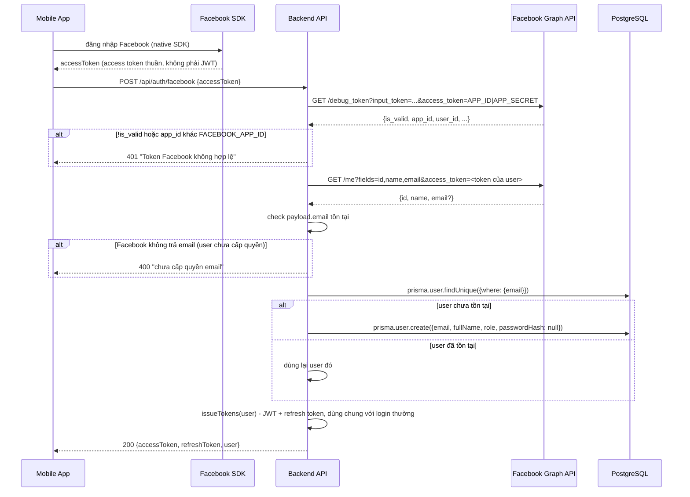

# Luồng đăng nhập bằng Facebook (OAuth2)

Áp dụng cho `POST /api/auth/facebook` (customer) và `POST /api/auth/facebook/owner` (station_owner). Tham chiếu code: `src/services/facebookAuthService.js`, `src/controllers/authController.js` (`findOrCreateFacebookUser`, `loginFacebookHandler`), `src/routes/auth.routes.js`. Cùng nguyên tắc thiết kế với [GOOGLE_AUTH_FLOW.md](GOOGLE_AUTH_FLOW.md) — không dùng Firebase Auth, chỉ verify token rồi tái dùng `issueTokens()` để cấp JWT của chính hệ thống.

## Khác biệt so với Google

Facebook **không cấp ID token (JWT)** như Google — SDK Facebook trả về 1 **access token thuần**, không tự chứa thông tin "cấp cho app nào" bên trong. Vì vậy verify Facebook cần **2 lệnh gọi API** thay vì 1 hàm verify như Google:

| | Google | Facebook |
|---|---|---|
| Loại token | ID token (JWT, tự chứa `aud`, `email`, `email_verified`...) | Access token thuần (không tự chứa thông tin gì) |
| Verify | 1 lệnh `client.verifyIdToken({idToken, audience})` — tự kiểm tra chữ ký + hạn + audience | 2 lệnh: `debug_token` (kiểm tra đúng app) rồi `/me` (lấy thông tin user) |
| Check email | Có sẵn `email_verified` trong token | Không có khái niệm này — chỉ check `email` có tồn tại trong response hay không |
| Package dùng | `google-auth-library` | Không cần package riêng — gọi thẳng REST API qua `axios` (đã có sẵn) |

## Sơ đồ luồng



## Chi tiết code

### `facebookAuthService.js` — verify token qua Graph API

```js
const axios = require('axios');

async function verifyFacebookToken(fbAccessToken) {
    // 1. Kiểm tra token có đúng cấp cho app của mình không
    const appAccessToken = `${process.env.FACEBOOK_APP_ID}|${process.env.FACEBOOK_APP_SECRET}`;
    const debugRes = await axios.get('https://graph.facebook.com/debug_token', {
        params: { input_token: fbAccessToken, access_token: appAccessToken },
    });

    const tokenData = debugRes.data.data;
    if (!tokenData.is_valid || tokenData.app_id !== process.env.FACEBOOK_APP_ID) {
        throw new Error('Facebook token không hợp lệ');
    }

    // 2. Lấy thông tin user thật
    const userRes = await axios.get('https://graph.facebook.com/me', {
        params: { fields: 'id,name,email', access_token: fbAccessToken },
    });

    return userRes.data; // { id, name, email }
}

module.exports = { verifyFacebookToken };
```

**Bước 1 — `debug_token`:** dùng **App Access Token** (`FACEBOOK_APP_ID|FACEBOOK_APP_SECRET`, chỉ backend biết) để hỏi Facebook "token này có hợp lệ không, và có đúng cấp cho app của tôi không". **Bắt buộc phải có bước này** — nếu bỏ qua, 1 access token hợp lệ được cấp cho **app Facebook khác** (do ai đó khác tạo) vẫn trả về thông tin user thật khi gọi `/me`, tạo lỗ hổng cho phép "mượn" token từ app khác để đăng nhập vào hệ thống của mình (kiểu tấn công **cross-app token reuse** — tương tự lý do Google phải check `audience`).

**Bước 2 — `/me`:** sau khi xác nhận token hợp lệ + đúng app, mới lấy thông tin thật. `fields=id,name,email` — Facebook Graph API **không tự trả hết thông tin theo mặc định**, phải liệt kê rõ field cần lấy. `email` **có thể không xuất hiện** trong response nếu user chưa cấp quyền lúc đăng nhập, hoặc tài khoản Facebook của họ không gắn email.

### `findOrCreateFacebookUser` — map payload sang `User`

```js
async function findOrCreateFacebookUser(payload, role) {
    if (!payload.email) {
        throw new AppError('Tài khoản Facebook của bạn chưa cấp quyền email, không thể đăng nhập', 400);
    }
    let user = await prisma.user.findUnique({ where: { email: payload.email } });
    if (!user) {
        user = await prisma.user.create({
            data: {
                email: payload.email,
                fullName: payload.name,
                role
            }
        });
    }
    return user;
}
```

Khác Google (check `email_verified`), Facebook không có khái niệm này — chỉ cần check **`email` có tồn tại** trong response hay không, vì Facebook chỉ trả email khi user đã thật sự cấp quyền. Còn lại giống hệt logic Google: tìm theo `email` trước, có thì dùng lại (kể cả tài khoản tạo qua `registerOwner` email+password trước đó), chưa có thì tạo mới không có `passwordHash` (chỉ đăng nhập được qua Facebook).

✅ **Bug đã sửa (2026-08-24):** code gốc từng gõ nhầm `payload.emai` (thiếu chữ `l`) ở cả 2 chỗ trong hàm này, khiến `!payload.emai` luôn `true` và hàm luôn throw lỗi dù Facebook đã trả `email` hợp lệ — đã sửa thành `payload.email`, code ở trên là bản đã fix.

### `loginFacebookHandler` — factory sinh route handler theo role

```js
function loginFacebookHandler(role) {
    return async (req, res, next) => {
        const { accessToken: fbAccessToken } = req.body;
        let payload;
        try {
            payload = await verifyFacebookToken(fbAccessToken);
        } catch (err) {
            return next(new AppError('Token Facebook không hợp lệ', 401));
        }

        const user = await findOrCreateFacebookUser(payload, role);
        const { accessToken, refreshToken } = await issueTokens(user, req);
        res.json({ data: { accessToken, refreshToken, user: sanitizeUser(user) } });
    };
}

const loginFacebookCustomer = loginFacebookHandler('customer');
const loginFacebookOwner = loginFacebookHandler('station_owner');
```

Cùng pattern factory với `loginGoogleHandler` — `role` khoá cứng theo endpoint gọi tới (`/facebook` → `customer`, `/facebook/owner` → `station_owner`), **không nhận `role` từ `req.body`**, tránh user tự phong quyền cho mình (IDOR/privilege escalation).

**Lưu ý đặt tên biến:** `req.body.accessToken` (token Facebook client gửi) destructure thành `fbAccessToken` — tránh trùng tên với `accessToken` (JWT hệ thống, lấy từ `issueTokens` ở dòng dưới) trong cùng 1 hàm.

## Route

```js
router.post('/facebook', authLimiter, [body('accessToken').notEmpty()], validate, authController.loginFacebookCustomer);
router.post('/facebook/owner', authLimiter, [body('accessToken').notEmpty()], validate, authController.loginFacebookOwner);
```

`authLimiter` (10 request/15 phút) — mỗi request thành công tốn 2 lệnh gọi Graph API (`debug_token` + `/me`), nên rate-limit còn có tác dụng phụ bảo vệ **quota gọi API với Facebook**, tránh bị chính Facebook giới hạn ngược nếu bị spam request.

## Các trường hợp đã xử lý

- **Token giả/hết hạn/thu hồi** → `debug_token` trả `is_valid: false` → `401`
- **Token hợp lệ nhưng cấp cho app Facebook khác** → `tokenData.app_id !== FACEBOOK_APP_ID` → `401` (chặn cross-app token reuse)
- **User chưa cấp quyền email** → `/me` không trả `email` → `400`
- **Email đã có tài khoản** (đăng ký trước qua `registerOwner` hoặc Google) → tự động gắn vào đúng tài khoản cũ, không tạo trùng

## Giới hạn hiện tại / việc cần làm tiếp

- **Chưa test tay** — App Facebook đang ở chế độ **Development** — chỉ tài khoản Tester/Admin của app mới đăng nhập test được, cần xin Facebook duyệt (App Review) trước khi launch thật cho user ngoài
- Chưa test qua mobile app thật (Facebook SDK cho React Native) — mới test bằng access token lấy thủ công qua Graph API Explorer
- Apple OAuth (nhắc trong tech stack gốc) vẫn chưa làm
