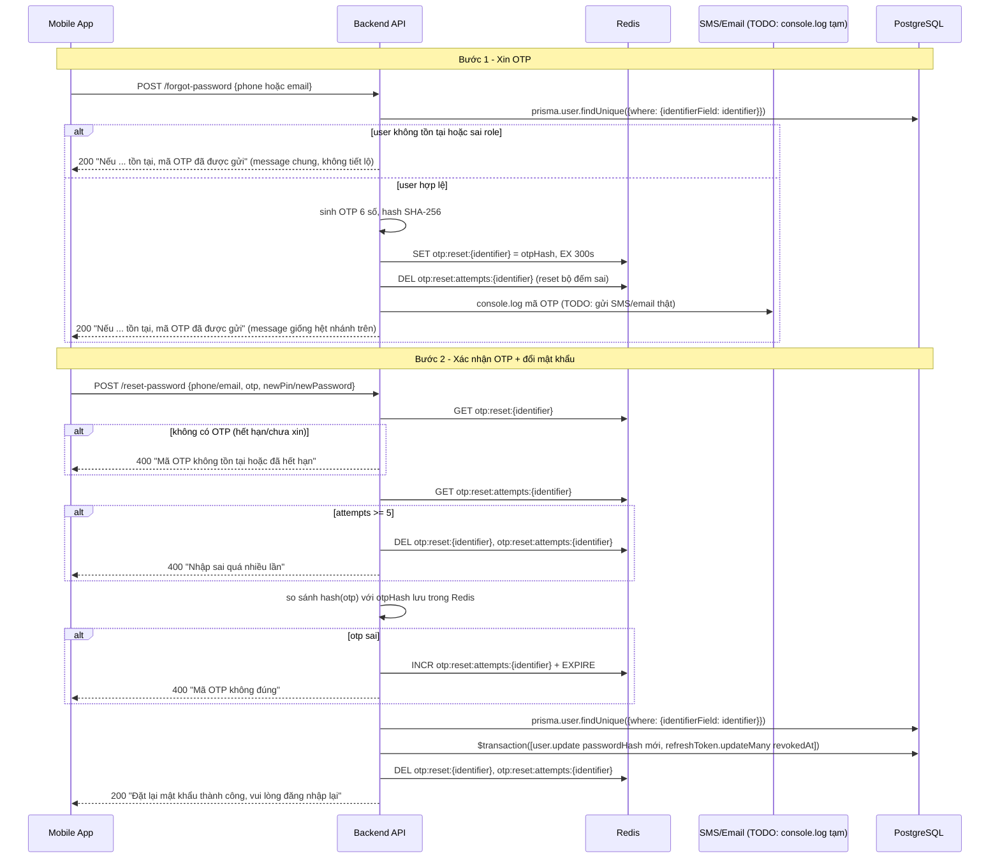

# Luồng quên mật khẩu & đặt lại mật khẩu (Forgot/Reset Password)

Áp dụng cho 4 endpoint: `POST /api/auth/forgot-password` + `POST /api/auth/reset-password` (customer, phone + PIN) và `POST /api/auth/forgot-password/owner` + `POST /api/auth/reset-password/owner` (station_owner, email + password). Tham chiếu code: `src/controllers/authController.js` (`forgotPasswordHandler`, `resetPasswordHandler`, `resetOtpKey`, `resetOtpAttemptsKey`), `src/routes/auth.routes.js`. Cùng nguyên tắc thiết kế với [GOOGLE_AUTH_FLOW.md](GOOGLE_AUTH_FLOW.md)/[FACEBOOK_AUTH_FLOW.md](FACEBOOK_AUTH_FLOW.md) — tái dùng tối đa hạ tầng đã có (OTP qua Redis, `issueTokens`), không tạo cơ chế mới.

## Ý tưởng cốt lõi

Đây là quy trình **2 bước**, y hệt tinh thần `registerCustomer` + `verifyOtp` (đăng ký cũng là gửi OTP rồi xác nhận), nhưng dùng **namespace Redis riêng** (`otp:reset:*` thay vì `otp:register:*`) để không đụng độ với OTP đăng ký nếu 1 số điện thoại vừa đăng ký vừa quên mật khẩu cùng lúc:

1. **Bước 1 — `forgotPasswordHandler`:** user gửi `phone`/`email` → hệ thống sinh OTP, lưu hash vào Redis (TTL 5 phút), "gửi" (tạm thời `console.log`, chưa có SMS/email provider thật).
2. **Bước 2 — `resetPasswordHandler`:** user gửi lại `phone`/`email` + `otp` + mật khẩu mới → verify OTP đúng cách `verifyOtp` đang làm, rồi đổi mật khẩu **và** thu hồi toàn bộ refresh token cũ của user (đăng xuất hết các thiết bị đang đăng nhập).

Cả 2 bước đều dùng **1 factory function duy nhất**, tham số hoá theo role (`customer` dùng `phone`/PIN, `station_owner` dùng `email`/password) — giống hệt cách `loginGoogleHandler(role)`/`loginFacebookHandler(role)` dùng chung 1 khung sườn cho 2 role.

## So sánh 2 biến thể customer / owner

| | Customer | Station owner |
|---|---|---|
| Định danh (`identifierField`) | `phone` | `email` |
| Mật khẩu mới (`credentialField`) | `newPin` (6 số) | `newPassword` (tối thiểu 8 ký tự) |
| `role` check | `UserRole.customer` | `UserRole.station_owner` |
| Rate limiter | `pinLimiter` (5 lần/15 phút — PIN chỉ 1 triệu tổ hợp) | `authLimiter` (10 lần/15 phút) |
| Kênh gửi OTP (hiện tại) | `console.log` (SMS thật là TODO) | `console.log` (email thật là TODO) |

## Sơ đồ luồng



## Chi tiết code

### Redis key helper — namespace riêng cho reset, tách khỏi OTP đăng ký

```js
function resetOtpKey(identifier) {
    return `otp:reset:${identifier}`;
}

function resetOtpAttemptsKey(identifier) {
    return `otp:reset:attempts:${identifier}`;
}
```

Bản sao của `otpKey`/`otpAttemptsKey` (dùng cho `registerCustomer`/`verifyOtp`), chỉ đổi tiền tố `otp:register:` → `otp:reset:`. `identifier` đặt tên chung (không gọi cứng `phone`) vì hàm này dùng chung cho cả `phone` (customer) lẫn `email` (owner). Tách namespace để 1 số điện thoại **vừa đăng ký vừa quên mật khẩu cùng lúc** không bị 2 luồng OTP ghi đè lẫn nhau.

### `forgotPasswordHandler` — bước 1, phát OTP

```js
function forgotPasswordHandler({ role, identifierField, channelLabel }) {
    return async (req, res, next) => {
        const identifier = req.body[identifierField];
        const user = await prisma.user.findUnique({ where: { [identifierField]: identifier } });

        // không tiết lộ identifier có tồn tại hay không -> generic response
        const genericMessage = `Nếu ${channelLabel} tồn tại, mã OTP đã được gửi`;

        if (!user || user.role !== role) {
            return res.json({ data: { message: genericMessage } });
        }

        const otp = crypto.randomInt(100000, 999999).toString();
        const otpHash = crypto.createHash('sha256').update(otp).digest('hex');

        await redis.set(resetOtpKey(identifier), otpHash, 'EX', RESET_OTP_TTL_SECONDS);
        // dùng để xóa bộ đếm số lần nhập otp sai khi có otp mới
        await redis.del(resetOtpAttemptsKey(identifier));

        // TODO: thay bằng gửi SMS/email thật khi chọn được nhà cung cấp
        console.log(`[OTP] Gửi mã đặt lại mật khẩu ${otp} tới ${channelLabel} ${identifier} (hết hạn sau ${RESET_OTP_TTL_SECONDS / 60} phút)`);

        res.json({ data: { message: genericMessage } });
    };
}

const forgotPasswordCustomer = forgotPasswordHandler({ role: UserRole.customer, identifierField: 'phone', channelLabel: 'số điện thoại' });
const forgotPasswordOwner = forgotPasswordHandler({ role: UserRole.station_owner, identifierField: 'email', channelLabel: 'email' });
```

- **`identifierField`/`channelLabel` tham số hoá theo role** — factory dùng `req.body[identifierField]` (computed property) và `prisma.user.findUnique({ where: { [identifierField]: identifier } })` để 1 khối logic chạy đúng cho cả `phone` lẫn `email`, không phải viết 2 hàm gần như y hệt.
- **Chống user enumeration:** nhánh `!user || user.role !== role` trả về **message giống hệt** nhánh thành công (`genericMessage`) — không báo "không tìm thấy tài khoản". Nếu báo khác nhau, kẻ tấn công có thể dò được số điện thoại/email nào đã đăng ký trong hệ thống. Đây là điểm **khác** với `registerCustomer` (báo thẳng "đã được sử dụng") — quên mật khẩu nhạy cảm hơn nên cần giấu.
- **Sinh + băm OTP** giống hệt `registerCustomer`: `crypto.randomInt(100000, 999999)` sinh số 6 chữ số, băm SHA-256 trước khi lưu Redis (không lưu OTP dạng plaintext, phòng trường hợp Redis bị lộ).
- **`redis.del(resetOtpAttemptsKey(identifier))`**: mỗi lần phát OTP mới thì reset bộ đếm sai về 0 — tránh trường hợp user bị cộng dồn số lần sai từ 1 OTP cũ (đã hết hạn) sang OTP mới vừa xin, gây khoá oan.
- **`console.log(...)` là TODO** — chưa tích hợp nhà cung cấp SMS/email thật, xem mục "Giới hạn" bên dưới.

### `resetPasswordHandler` — bước 2, xác nhận OTP + đổi mật khẩu

```js
function resetPasswordHandler({ role, identifierField, credentialField }) {
    return async (req, res, next) => {
        const identifier = req.body[identifierField];
        const { otp } = req.body;
        const newCredential = req.body[credentialField];

        const otpHash = await redis.get(resetOtpKey(identifier));
        if (!otpHash) {
            return next(new AppError('Mã OTP không tồn tại hoặc đã hết hạn, vui lòng yêu cầu lại', 400));
        }

        const attempts = Number(await redis.get(resetOtpAttemptsKey(identifier))) || 0;
        if (attempts >= MAX_RESET_OTP_ATTEMPTS) {
            await redis.del(resetOtpKey(identifier), resetOtpAttemptsKey(identifier));
            return next(new AppError('Nhập sai quá nhiều lần, vui lòng yêu cầu lại', 400));
        }

        const inputHash = crypto.createHash('sha256').update(otp).digest('hex');
        if (inputHash !== otpHash) {
            await redis.multi().incr(resetOtpAttemptsKey(identifier)).expire(resetOtpAttemptsKey(identifier), RESET_OTP_TTL_SECONDS).exec();
            return next(new AppError('Mã OTP không đúng', 400));
        }

        const user = await prisma.user.findUnique({ where: { [identifierField]: identifier } });
        if (!user || user.role !== role) {
            return next(new AppError('Không tìm thấy tài khoản', 400));
        }

        const passwordHash = await bcrypt.hash(newCredential, 12);
        await prisma.$transaction([
            prisma.user.update({ where: { id: user.id }, data: { passwordHash } }),
            prisma.refreshToken.updateMany({
                where: { userId: user.id, revokedAt: null },
                data: { revokedAt: new Date() },
            }),
        ]);

        await redis.del(resetOtpKey(identifier), resetOtpAttemptsKey(identifier));
        res.json({ data: { message: 'Đặt lại mật khẩu thành công, vui lòng đăng nhập lại' } });
    };
}

const resetPasswordCustomer = resetPasswordHandler({ role: UserRole.customer, identifierField: 'phone', credentialField: 'newPin' });
const resetPasswordOwner = resetPasswordHandler({ role: UserRole.station_owner, identifierField: 'email', credentialField: 'newPassword' });
```

- **Verify OTP** (đoạn `otpHash`/`attempts`/`inputHash`) copy nguyên logic từ `verifyOtp` (không có gì mới): không có OTP → hết hạn; đủ 5 lần sai → khoá + xoá luôn OTP hiện tại (không cho thử tiếp, ép xin OTP mới); sai → tăng bộ đếm bằng `redis.multi()...exec()` (gộp `incr` + `expire` thành 1 thao tác atomic, tránh race condition khi có nhiều request đồng thời).
- **Tìm lại `user` sau khi OTP đúng** — cần `user.id` để update DB (Prisma update theo khoá chính, không update trực tiếp theo `phone`/`email` tiện lợi bằng). Check `user.role !== role` là lớp phòng thủ thêm, giống `forgotPasswordHandler`.
- **`prisma.$transaction([...])` — phần quan trọng nhất của cả hàm:** gộp 2 việc "đổi mật khẩu" và "thu hồi hết refresh token cũ" thành 1 giao dịch DB, hoặc cả 2 cùng thành công hoặc cùng rollback. Nếu tách riêng 2 lệnh, lỡ server crash giữa chừng có thể rơi vào trạng thái nguy hiểm nhất: **đổi mật khẩu thành công nhưng token cũ (đã có thể bị lộ — lý do user đổi mật khẩu) vẫn còn dùng được**. Đoạn `refreshToken.updateMany({ where: { userId: user.id, revokedAt: null }, ... })` copy nguyên logic "revoke hết session" đã có sẵn trong `refreshTokenHandler` (dùng khi phát hiện refresh token bị tái sử dụng/đánh cắp).
- **Xoá 2 key Redis sau khi thành công** — đảm bảo 1 OTP chỉ dùng được **đúng 1 lần**, chặn replay attack (gửi lại y hệt request cũ để đổi mật khẩu lần 2 bằng OTP đã dùng).
- **`bcrypt.hash(newCredential, 12)`** — cost factor `12` đồng nhất với `registerCustomer`/`registerOwner`, không được để lệch giữa các chỗ hash mật khẩu trong hệ thống.

## Route

```js
router.post(
    '/forgot-password',
    pinLimiter,
    [body('phone').matches(/^0\d{9}$/).withMessage('Số điện thoại không hợp lệ')],
    validate,
    authController.forgotPasswordCustomer
);

router.post(
    '/forgot-password/owner',
    authLimiter,
    [body('email').isEmail().withMessage('Email không hợp lệ')],
    validate,
    authController.forgotPasswordOwner
);

router.post(
    '/reset-password',
    pinLimiter,
    [
        body('phone').matches(/^0\d{9}$/).withMessage('Số điện thoại không hợp lệ'),
        body('otp').matches(/^\d{6}$/).withMessage('Mã OTP phải gồm đúng 6 chữ số'),
        body('newPin').matches(/^\d{6}$/).withMessage('Mã PIN phải gồm đúng 6 chữ số'),
    ],
    validate,
    authController.resetPasswordCustomer
);

router.post(
    '/reset-password/owner',
    authLimiter,
    [
        body('email').isEmail().withMessage('Email không hợp lệ'),
        body('otp').matches(/^\d{6}$/).withMessage('Mã OTP phải gồm đúng 6 chữ số'),
        body('newPassword').isLength({ min: 8 }).withMessage('Mật khẩu tối thiểu 8 ký tự'),
    ],
    validate,
    authController.resetPasswordOwner
);
```

`pinLimiter` cho 2 route customer (đúng convention với `/register`, `/login` — PIN 6 số dễ đoán hơn), `authLimiter` cho 2 route owner (đúng convention với `/register/owner`, `/login/owner`).

## Các trường hợp đã xử lý

- **Số điện thoại/email không tồn tại, hoặc tồn tại nhưng sai role** → `forgot-password` vẫn trả `200` với message chung, không tiết lộ (chống dò tài khoản)
- **OTP hết hạn (quá 5 phút) hoặc chưa từng xin** → `reset-password` trả `400`
- **Nhập sai OTP quá 5 lần** → khoá, xoá luôn OTP hiện tại, bắt xin lại từ đầu (chặn brute-force 1 triệu tổ hợp)
- **Xin OTP mới sau khi OTP cũ hết hạn/bị khoá** → bộ đếm sai reset về 0, không cộng dồn oan từ phiên trước
- **Đổi mật khẩu thành công** → thu hồi toàn bộ refresh token đang sống của user, mọi thiết bị đang đăng nhập bị đăng xuất, bắt đăng nhập lại bằng mật khẩu mới
- **Dùng lại OTP đã xác nhận thành công** (replay) → không được, vì OTP đã bị xoá khỏi Redis ngay sau khi dùng

## ✅ Bug đã sửa (2026-08-26)

Trong lúc code tay, `resetPasswordHandler` từng dính liền 3 lỗi trước khi hoàn thiện như bản trên:
1. `const otp = req.body;` (gán cả object thay vì `const { otp } = req.body;`) → `crypto...update(otp)` throw lỗi vì nhận object thay vì string
2. Tên tham số factory khai báo `credential` nhưng lúc gọi lại truyền `credentialField` → `newCredential` luôn `undefined`
3. Quên export `resetPasswordCustomer`/`resetPasswordOwner` trong `module.exports`

Ở tầng route, từng thiếu dấu `/` đầu path (`'forgot-password'` thay vì `'/forgot-password'` — khiến route không bao giờ khớp request thật, luôn `404`), thiếu validate `otp`/mật khẩu mới ở cả 2 route reset-password, và route `/reset-password/owner` từng validate nhầm field `newPin` (6 số) thay vì `newPassword` (tối thiểu 8 ký tự) đúng theo controller đang đọc.

## Giới hạn hiện tại / việc cần làm tiếp

- **Chưa gửi SMS/email thật** — cả 2 kênh đang tạm `console.log` mã OTP ra terminal, cần chọn nhà cung cấp (SMS: eSMS/SpeedSMS/Twilio; email: SendGrid/SES...) trước khi launch
- **Chưa test tay qua Postman/app thật** — mới review code tĩnh, chưa gọi thử endpoint để xác nhận luồng chạy đúng end-to-end (xem `GET /api/health` cách verify nhanh trong `backend-workflow.md`)
- **Chưa cập nhật mục "API endpoints" trong `backend/CLAUDE.md`** — theo `backend-workflow.md`, thêm endpoint mới bắt buộc cập nhật tài liệu đó cùng lúc, hiện vẫn còn ghi dòng cũ `POST /api/auth/forgot-password` (không có 3 endpoint còn lại)
- **`registerCustomer` vẫn tiết lộ số điện thoại đã tồn tại hay chưa** (báo thẳng "đã được sử dụng") — không đồng nhất với nguyên tắc "chống enumeration" áp dụng ở `forgot-password`; chấp nhận được vì rủi ro khác nhau giữa 2 luồng, nhưng nên cân nhắc nếu siết bảo mật thêm
- Chưa có test tự động (`jest`) cho luồng này
