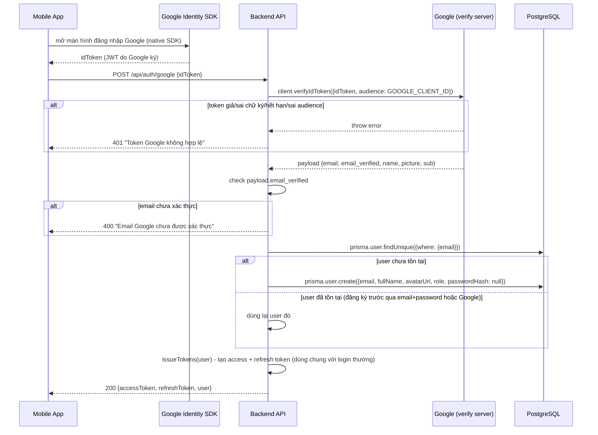

# Luồng đăng nhập bằng Google (OAuth2)

Áp dụng cho `POST /api/auth/google` (customer) và `POST /api/auth/google/owner` (station_owner). Tham chiếu code: `src/services/googleAuthService.js` (verify token), `src/services/authService.js` (`findOrCreateGoogleUser`), `src/services/tokenService.js` (`issueTokens`), `src/controllers/authController.js` (`loginGoogleHandler` — chỉ orchestration, gọi 3 service trên), `src/routes/auth.routes.js`.

## Vì sao không dùng Firebase Auth

Google/Facebook OAuth login không bắt buộc phải đi qua Firebase — mobile app tự lấy ID token từ SDK Google, gửi thẳng cho backend verify, backend vẫn là **nguồn sự thật duy nhất** cho phiên đăng nhập (JWT tự viết, dùng chung `issueTokens()` với `loginCustomer`/`loginOwner`). Firebase Auth không được dùng để tránh 2 hệ thống auth song song.

## Ý tưởng cốt lõi: backend không tự làm màn hình đăng nhập Google

Mobile app dùng SDK Google (`@react-native-google-signin/google-signin` phía RN) để mở màn hình đăng nhập Google **native trên máy user**, lấy về 1 **ID token** (1 chuỗi JWT do Google ký) sau khi user đăng nhập + đồng ý chia sẻ thông tin. App gửi chuỗi này lên backend — backend **không tự tạo** giao diện đăng nhập Google nào cả, chỉ có nhiệm vụ **verify token** rồi map sang tài khoản trong hệ thống của mình.

## Sơ đồ luồng



## Chi tiết từng phần code

### `googleAuthService.js` — chỗ verify token

```js
const { OAuth2Client } = require('google-auth-library');

const client = new OAuth2Client(process.env.GOOGLE_CLIENT_ID);

async function verifyGoogleToken(idToken) {
    const ticket = await client.verifyIdToken({
        idToken,
        audience: process.env.GOOGLE_CLIENT_ID,
    });
    return ticket.getPayload();
}
```

`verifyIdToken` tự kiểm tra 3 việc, throw lỗi nếu bất kỳ điều nào sai:
1. **Chữ ký** — token có đúng do server Google ký (dùng public key Google công bố), không bị giả mạo/sửa
2. **Hạn dùng** — ID token Google thường sống khoảng 1 giờ
3. **`audience`** — token này có đúng cấp **cho app của bạn** (`GOOGLE_CLIENT_ID`) không, chặn trường hợp 1 token hợp lệ nhưng cấp cho app khác bị đem qua dùng

### `findOrCreateGoogleUser` (trong `src/services/authService.js`) — map payload Google sang `User` trong hệ thống

```js
async function findOrCreateGoogleUser(payload, role) {
    if (!payload.email_verified) {
        throw new AppError('Email Google chưa được xác thực', 400);
    }

    let user = await prisma.user.findUnique({ where: { email: payload.email } });

    if (!user) {
        user = await prisma.user.create({
            data: {
                email: payload.email,
                fullName: payload.name,
                avatarUrl: payload.picture,
                role,
            },
        });
    }
    return user;
}
```

- Chặn email chưa được Google xác thực (`email_verified`) — không tin email lạ chưa confirm
- Tìm theo `email` trước — nếu **đã có tài khoản** (đăng ký trước bằng `registerOwner` email+password, hoặc từng login Google trước đó), dùng lại đúng user đó, không tạo trùng
- Nếu **chưa có**, tạo mới **không có `passwordHash`** (để `null`) — tài khoản này chỉ đăng nhập được qua Google, gọi `loginOwner` (email+password) sẽ bị chặn ở check `!user.passwordHash` có sẵn từ trước
- `role` nhận từ ngoài truyền vào — để dùng chung được cho cả customer lẫn station_owner

### `loginGoogleHandler` (trong `authController.js`) — factory sinh route handler theo role

```js
function loginGoogleHandler(role) {
    return async (req, res, next) => {
        const { idToken } = req.body;
        let payload;
        try {
            payload = await verifyGoogleToken(idToken);
        } catch (err) {
            return next(new AppError('Token Google không hợp lệ', 401));
        }

        const user = await findOrCreateGoogleUser(payload, role);
        const { accessToken, refreshToken } = await issueTokens(user, req);
        res.json({ data: { accessToken, refreshToken, user: sanitizeUser(user) } });
    };
}

const loginGoogleCustomer = loginGoogleHandler(UserRole.customer);
const loginGoogleOwner = loginGoogleHandler(UserRole.station_owner);
```

`loginGoogleCustomer`/`loginGoogleOwner` giống hệt nhau, chỉ khác `role` truyền vào `findOrCreateGoogleUser` — gộp chung logic qua 1 hàm factory (closure "khoá" `role` tại lúc tạo) thay vì viết lặp lại 2 hàm gần như y hệt. `findOrCreateGoogleUser`, `issueTokens`, `sanitizeUser` giờ là hàm **import từ service** (`authService.js`/`tokenService.js`), bản thân `loginGoogleHandler` không còn tự viết logic DB/token nào — chỉ gọi 3 hàm đó theo đúng thứ tự rồi trả response (xem thêm mục "Tách controller/service" ở cuối file này).

`try/catch` quanh `verifyGoogleToken` là chỗ bắt buộc phải tự xử lý (khác các chỗ khác trong file để Express 5 tự forward lỗi) — vì muốn trả về đúng message "Token Google không hợp lệ" dễ hiểu, thay vì để lỗi kỹ thuật gốc từ `google-auth-library` lộ ra ngoài.

## Route

```js
router.post('/google', authLimiter, [body('idToken').notEmpty()], validate, authController.loginGoogleCustomer);
router.post('/google/owner', authLimiter, [body('idToken').notEmpty()], validate, authController.loginGoogleOwner);
```

Dùng `authLimiter` (10 request/15 phút) — không dùng `pinLimiter` vì không liên quan PIN.

## Các trường hợp đã xử lý

- **Token giả/hết hạn/sai audience** → `verifyIdToken` throw → `401 "Token Google không hợp lệ"`
- **Email Google chưa xác thực** → `400 "Email Google chưa được xác thực"`
- **Email đã có tài khoản** (đăng ký trước qua email+password) → login Google lần đầu bằng email đó sẽ **tự động gắn vào đúng tài khoản cũ**, không tạo trùng — 2 cách đăng nhập cùng dẫn về 1 user
- **Login Google nhiều lần với cùng email** → lần 2 trở đi tìm thấy user đã tồn tại, không tạo mới, vẫn cấp token bình thường

## Giới hạn hiện tại / việc cần làm tiếp

- Chỉ mới làm **Google** — **Facebook**, **Apple** (đã ghi trong tech stack gốc) chưa code, dự kiến làm theo đúng pattern này, chỉ khác cách verify token (Facebook Graph API, Apple JWT với public key riêng)
- Chưa test qua mobile app thật (SDK `@react-native-google-signin/google-signin`) — mới test bằng cách lấy `id_token` thủ công qua Google OAuth Playground
- User tạo qua Google không có `passwordHash` — nếu sau này muốn cho phép họ "đặt thêm password" để login cả 2 cách, cần thêm 1 endpoint riêng (chưa có)

## Tách controller/service (2026-08-26)

`authController.js` từng tự viết hết logic (bcrypt, JWT, query Prisma) ngay trong từng handler — giờ đã tách sang 2 file service để `authController.js` chỉ còn orchestration:
- `src/services/tokenService.js` — `issueTokens`, `rotateRefreshToken`, `revokeAllUserTokens`, `hashToken`
- `src/services/authService.js` — `findOrCreateGoogleUser`, `findOrCreateFacebookUser`, `sanitizeUser`, `hashCredential`/`verifyCredential` (bcrypt), OTP helpers, `updatePasswordAndRevokeSessions`

`googleAuthService.js` (verify token) không đổi gì — vẫn đúng vị trí cũ.
