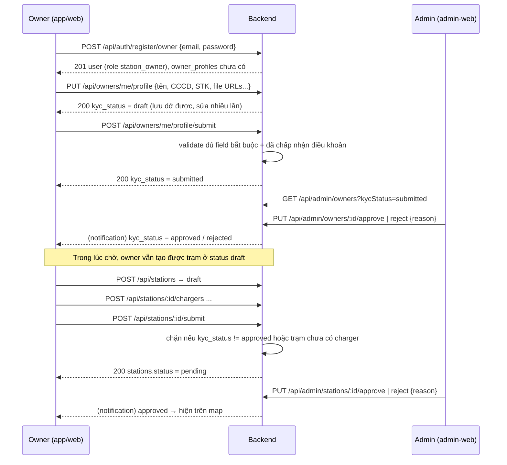

# Luồng đăng ký & duyệt chủ trạm (đợt 1 — chưa code)

File này chốt **quyết định thiết kế** cho phần onboarding owner (hồ sơ, giấy tờ, STK, admin duyệt, hợp đồng). Làm **cùng đợt 1** với station core ([STATION_FLOW.md](STATION_FLOW.md)) — không có duyệt hồ sơ thì đợt 1 chỉ toàn trạm nháp, không có trạm thật nào lên map được. Mô hình tham khảo: Grab / Be — 1 merchant account, duyệt hồ sơ 1 lần, mỗi cửa hàng duyệt riêng.

Thứ tự code gợi ý trong đợt 1: station CRUD → upload presign → owner profile + submit → admin routes (owners + stations) → `POST /stations/:id/submit`. Admin-web UI có thể làm sau; trong lúc đó admin gọi route admin qua Postman.

## 1. Vì sao cần duyệt

Đây là marketplace **có tiền chảy qua**: customer trả → nền tảng giữ → chuyển (payout) cho owner. Không xác minh danh tính + STK chính chủ thì:
- không có cách nào payout an toàn (chuyển nhầm người, không đòi lại được);
- trạm "ma" xuất hiện trên map, customer đặt lịch rồi đến nơi không có gì;
- không có căn cứ pháp lý khi tranh chấp.

## 2. Hai tầng duyệt

| Tầng | Duyệt cái gì | Bao nhiêu lần | Lưu ở đâu |
|---|---|---|---|
| **1. Chủ tài khoản (KYC)** | Danh tính, pháp nhân, STK | 1 lần / owner | `owner_profiles.kyc_status` |
| **2. Từng trạm** | Địa chỉ thật, ảnh, ổ sạc hợp lệ | mỗi trạm | `stations.status` |

Tách 2 tầng vì: hồ sơ pháp lý không đổi khi mở thêm chi nhánh (không bắt nộp lại CCCD mỗi lần), còn mỗi trạm vẫn cần admin xác nhận địa điểm có thật.

## 3. Luồng tổng thể



Quyết định quan trọng: **cho tạo trạm `draft` ngay cả khi KYC chưa duyệt**, chỉ chặn ở bước `submit` trạm. Owner có việc làm (nhập ổ sạc, ảnh) trong lúc chờ admin → giảm tỉ lệ bỏ cuộc khi onboarding. Grab làm tương tự.

## 4. Bảng mới `owner_profiles` (1–1 với `users`)

Dự kiến, chốt lại khi làm:

```
owner_profiles
  id                     UUID PK
  user_id                UUID UNIQUE REFERENCES users(id)
  -- pháp lý
  business_type          ENUM('individual', 'company')
  business_name          VARCHAR            -- tên DN, hoặc họ tên nếu cá nhân
  tax_code               VARCHAR            -- MST, bắt buộc nếu company
  id_number              VARCHAR            -- số CCCD (nhạy cảm)
  id_front_url           VARCHAR            -- ảnh CCCD mặt trước (bucket private)
  id_back_url            VARCHAR
  business_license_url   VARCHAR            -- GPKD, bắt buộc nếu company
  -- thanh toán (payout)
  bank_name              VARCHAR
  bank_account_number    VARCHAR            -- nhạy cảm
  bank_account_holder    VARCHAR            -- phải khớp tên trên CCCD/GPKD, admin đối chiếu tay
  -- duyệt
  kyc_status             ENUM('draft', 'submitted', 'approved', 'rejected')
  rejected_reason        VARCHAR
  reviewed_by            UUID REFERENCES users(id)   -- admin nào duyệt
  reviewed_at            TIMESTAMP
  -- hợp đồng
  terms_version          VARCHAR            -- "v1.0"
  terms_accepted_at      TIMESTAMP
  terms_accepted_ip      VARCHAR
  contract_file_url      VARCHAR            -- scan hợp đồng giấy đã ký (nếu có), bucket private
  contract_signed_at     TIMESTAMP          -- admin tick sau khi nhận bản ký
  created_at, updated_at TIMESTAMP
```

Vòng đời `kyc_status`:

```
draft → submitted → approved
                  → rejected → (owner sửa) → submitted
```

Không có `suspended` ở tầng owner trong đợt 1 — khoá owner = khoá toàn bộ trạm của họ (`stations.status = suspended`), đơn giản hơn và giữ được lịch sử. Cân nhắc thêm sau nếu cần khoá đăng nhập.

## 5. Hợp đồng — làm nhẹ tay

**Không** tích hợp ký điện tử (VNPT eContract, FPT.eSign...) ở giai đoạn này: tốn phí, cần pháp nhân, tích hợp nặng. Cũng **không** tự build "ký tay trên màn hình" — không có giá trị pháp lý mà tốn công.

Thay vào đó:

1. **Click-wrap agreement**: màn "Điều khoản hợp tác" (HTML/PDF có version). Owner bấm "Tôi đồng ý" → lưu `terms_version + terms_accepted_at + terms_accepted_ip`. Là điều kiện bắt buộc để `submit` hồ sơ.
2. **Hợp đồng giấy (nếu cần)**: xử lý **offline** — admin gửi PDF, owner ký, chụp/upload → `contract_file_url`; admin xác nhận → `contract_signed_at`. Backend chỉ lưu bằng chứng, không tham gia quy trình ký.

Đổi điều khoản → tăng `terms_version`, owner cũ phải chấp nhận lại khi đăng nhập (check `terms_version` hiện tại vs đã lưu).

## 6. File upload — chưa có trong stack, phải thêm

Cần **2 loại bucket**:

| Loại | Nội dung | Quyền đọc |
|---|---|---|
| **Private** | CCCD, GPKD, scan hợp đồng | Chỉ owner đó + admin, qua **signed URL có hạn** (vd 15 phút). Không bao giờ public |
| **Public** | Ảnh trạm (`stations.image_urls`), avatar | Ai cũng đọc được qua URL thẳng |

Luồng upload đề xuất: client xin **presigned URL** từ backend (`POST /api/uploads/presign {type, mime}`) → upload thẳng lên storage → gửi URL/key về backend khi lưu profile. Backend không nhận file qua Express (không tốn RAM/băng thông server).

Provider: **chưa chọn** — Cloudinary (setup nhanh, free tier ổn, có transform ảnh) vs S3/Cloudflare R2 (rẻ hơn khi lớn, presigned URL chuẩn). **Phải chốt trước khi code phần profile** — là việc chặn đường (blocker) đầu tiên của onboarding.

## 7. Dữ liệu nhạy cảm

`id_number`, `bank_account_number`, các URL giấy tờ:
- **Không bao giờ** xuất hiện trong response public (`GET /stations/:id`, `GET /users/:id`...).
- Chỉ trả trong `GET /api/owners/me/profile` (chính chủ) và `GET /api/admin/owners/:id` (admin).
- Log không được in `req.body` của các endpoint profile.
- Cân nhắc mã hoá at-rest (`pgcrypto` hoặc app-level) cho `id_number` + `bank_account_number` — chưa quyết.

## 8. Endpoint dự kiến (bổ sung vào `backend/CLAUDE.md` khi làm)

```
# Owner onboarding (role: station_owner)
GET    /api/owners/me/profile
PUT    /api/owners/me/profile           # lưu dở, kyc_status giữ draft (hoặc rejected → draft)
POST   /api/owners/me/profile/submit    # draft/rejected → submitted, cần terms_accepted_at
POST   /api/owners/me/accept-terms      # lưu terms_version + timestamp + ip
POST   /api/stations/:id/submit         # draft/rejected → pending, chặn nếu KYC chưa approved

# Uploads
POST   /api/uploads/presign             # {type: 'kyc' | 'station_image', mime} → presigned URL

# Admin (role: admin)
GET    /api/admin/owners?kycStatus=
GET    /api/admin/owners/:id            # xem đủ hồ sơ + signed URL giấy tờ
PUT    /api/admin/owners/:id/approve
PUT    /api/admin/owners/:id/reject     # {reason}
GET    /api/admin/stations?status=
PUT    /api/admin/stations/:id/approve
PUT    /api/admin/stations/:id/reject   # {reason}
PUT    /api/admin/stations/:id/suspend  # {reason}
```

## 9. Kênh nào làm gì (mobile vs admin-web)

- **Mobile owner**: chụp CCCD (cần camera), xem trạng thái duyệt, chấp nhận điều khoản, vận hành hằng ngày.
- **admin-web (owner view)**: điền hồ sơ đầy đủ, upload GPKD/hợp đồng PDF, quản lý nhiều chi nhánh — việc nhập liệu nặng hợp với desktop hơn.
- **admin-web (admin)**: hàng đợi duyệt owner + trạm, xem giấy tờ qua signed URL, approve/reject kèm lý do.

Backend không phân biệt kênh — cùng endpoint, chỉ nhìn `role` trong JWT.

## 10. Chưa quyết — phải chốt trước khi code phần tương ứng

- **Provider upload** (Cloudinary vs S3/R2) — blocker, chốt đầu tiên.
- Mã hoá at-rest cho `id_number`, `bank_account_number` — có thể làm sau, nhưng nếu làm thì làm trước khi có dữ liệu thật.
- Notification khi duyệt/từ chối: push (Firebase) hay email hay cả hai. Tạm thời: owner tự vào xem `kyc_status` / `stations.status`, chưa notify.
- Có cho owner **sửa STK sau khi approved** không? Nếu có → phải duyệt lại STK riêng (chống đổi STK sang người khác sau khi được duyệt). Đề xuất: đổi STK → `kyc_status` về `submitted`, admin duyệt lại nhanh.
- Owner cá nhân có cần GPKD không (theo luật VN, kinh doanh trạm sạc có thể cần đăng ký hộ kinh doanh) — hỏi pháp lý.
