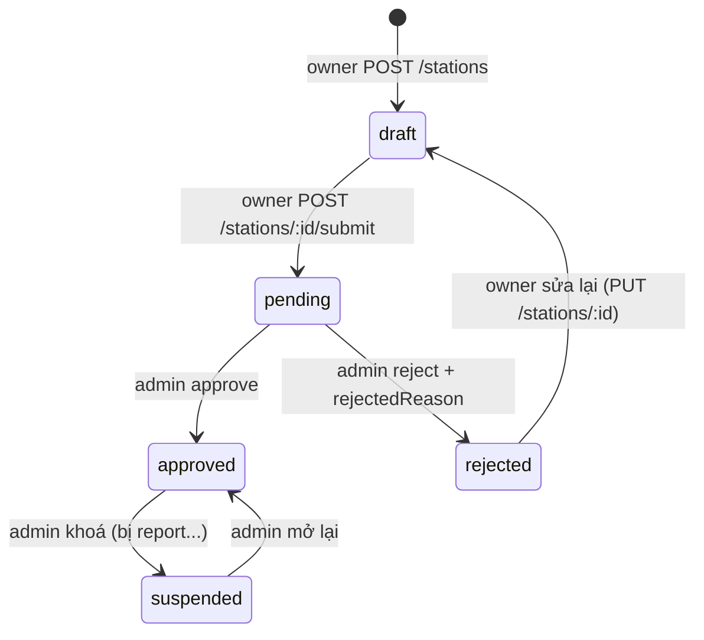

# Luồng station & chargers (đợt 1)

Phần này gồm: owner tạo/quản lý trạm + ổ sạc, owner gửi duyệt trạm, admin duyệt/khoá trạm, customer tìm/xem trạm. Đăng ký hồ sơ owner (KYC, STK, điều khoản, upload giấy tờ) — **cùng đợt 1** — tách file riêng vì khác module code: [OWNER_ONBOARDING_FLOW.md](OWNER_ONBOARDING_FLOW.md). **Không** gồm: booking, review. Tham chiếu code: `src/routes/stations.routes.js`, `src/controllers/stationController.js`, `src/services/stationService.js`, `prisma/schema.prisma` (model `Station`, `Charger`, enum `StationStatus`).

## 1. Mô hình: 1 owner → n trạm → n ổ sạc

```
users (role = station_owner)
  └── stations (owner_id)           "ABC Charging Station", địa chỉ, lat/lng, giá chung, giờ mở
        └── chargers (station_id)   Ổ #1 Type2 22kW [available]
                                     Ổ #2 Type2 22kW [charging]
                                     Ổ #3 CCS   60kW [maintenance]
```

- Một tài khoản owner mở được **nhiều trạm** (chi nhánh), giống 1 merchant Grab có nhiều cửa hàng. API/UI luôn giả định owner có **danh sách** trạm (`GET /api/stations/me` trả mảng), không bao giờ "trạm của owner" số ít.
- Customer **đặt 1 ổ sạc cụ thể** (`bookings.charger_id`), không đặt "trạm". Trạm chỉ là cái vỏ để tìm kiếm/hiển thị.
- Vì vậy các số như "8/10 ổ trống", "Type2 (6 available)" đều **tính từ `chargers`** tại thời điểm gọi, không lưu sẵn.

## 2. Hai cờ trên `stations`: `status` và `isActive`

Hai cờ này **khác chủ sở hữu**, không gộp làm một:

| Cờ | Ai được đổi | Ý nghĩa | Giá trị |
|---|---|---|---|
| `status` | **Admin** (qua `PUT /api/admin/stations/:id/approve|reject|suspend`) | Trạm có được phép tồn tại trên nền tảng không | `draft` / `pending` / `approved` / `rejected` / `suspended` |
| `isActive` | **Owner** | Hôm nay tôi có mở cửa không | `true` / `false` |

**Customer chỉ thấy trạm khi `status = 'approved' AND isActive = true`.** Mọi query public (`GET /stations`, `/stations/nearby`, `/stations/:id`) đều phải có điều kiện này trong `where` — không lấy hết rồi lọc sau. Owner xem trạm của mình (`/stations/me`) thì thấy đủ mọi status.

Lý do tách: admin `suspended` một trạm bị report mà không đụng vào cờ của owner; owner tạm đóng cửa nghỉ lễ mà không mất trạng thái đã duyệt.

## 3. Vòng đời `status`



Ai được chuyển:

| Chuyển | Ai | Ghi chú |
|---|---|---|
| `→ draft` | Owner (tạo mới) | Tạo được ngay cả khi hồ sơ KYC chưa duyệt — để owner có việc làm trong lúc chờ |
| `draft/rejected → pending` | Owner (`POST /stations/:id/submit`) | Chặn `400` nếu `owner_profiles.kyc_status != approved` hoặc trạm chưa có ổ sạc nào |
| `pending → approved/rejected` | Admin (`PUT /api/admin/stations/:id/approve|reject`) | Reject bắt buộc có `reason` → lưu `rejectedReason` |
| `approved ↔ suspended` | Admin (`PUT /api/admin/stations/:id/suspend|approve`) | Owner không tự gỡ `suspended` được |
| `rejected → draft` | Owner | Bất kỳ `PUT /stations/:id` nào trên trạm `rejected` sẽ tự đưa về `draft` và xoá `rejectedReason` |

Owner **không được** set `status` qua `PUT /stations/:id` — field này bị loại khỏi whitelist update; chỉ đổi qua `submit` (owner) hoặc route admin. Admin route + `submit` liệt kê ở mục 8 của [OWNER_ONBOARDING_FLOW.md](OWNER_ONBOARDING_FLOW.md).

Không có `DELETE /stations/:id`: bookings/reviews còn FK trỏ vào. "Xoá" = owner set `isActive = false`, hoặc admin `suspended`.

## 4. `chargers.status` — ai set cái gì

| Status | Ai set | Khi nào |
|---|---|---|
| `available` | Owner (phần station) | Bấm ENABLE trong Station Settings; hoặc booking kết thúc (phần booking) |
| `maintenance` | Owner (phần station) | Bấm DISABLE — ổ hỏng, bảo trì |
| `charging` | **Hệ thống** (phần booking, làm sau) | Owner bấm START CHARGING trên booking → END → về `available` |

Rule ở phần station: `PUT /stations/:id/chargers/:chargerId` chỉ chấp nhận `status ∈ {available, maintenance}`. Gửi `charging` → `400`. Lý do: tránh owner vô tình đánh dấu ổ đang có khách thành rảnh, hoặc khoá ổ đang sạc. Đổi sang/khỏi `charging` là việc của booking transaction.

Không `DELETE` charger đã từng có booking (FK). Đợt 1: cho `DELETE` thẳng nếu chưa có booking nào tham chiếu (Prisma sẽ ném lỗi FK nếu có → trả `400` "ổ sạc đã có lịch đặt, chỉ có thể chuyển sang maintenance").

## 5. Field dẫn xuất trên `stations`: `connectorTypes`, `totalOutlets`

Hai field này là **bản tóm tắt của `chargers`**, tồn tại để filter/hiển thị nhanh mà không phải join:

- `connectorTypes = SELECT DISTINCT connector_type FROM chargers WHERE station_id = ?`
- `totalOutlets = COUNT(*) FROM chargers WHERE station_id = ?`

**Không nhận từ client.** `POST/PUT /stations` bỏ qua 2 field này nếu client gửi. `stationService.syncDerivedFields(stationId)` tính lại và update sau **mỗi** lần `POST/PUT/DELETE` charger (và sau nested create chargers lúc `POST /stations`).

Số ổ **đang trống** ("8/10 available") thì **không** denormalize — đổi liên tục theo booking, tính lúc đọc bằng `_count` với `where: { status: 'available' }`.

## 6. Giá

- `stations.pricePerKwh` — giá chung của trạm (VNĐ/kWh, `DECIMAL(10,2)` — bản cũ `DECIMAL(5,2)` chỉ tới 999.99, không chứa nổi giá VN).
- `chargers.pricePerKwh` — nullable, **override** cho ổ đó. `null` → dùng giá trạm.
- Giá thực tế của 1 ổ = `charger.pricePerKwh ?? station.pricePerKwh`. Đóng gói thành `stationService.effectivePrice(charger, station)` để phần booking dùng lại khi tính `bookings.totalAmount`.

Lý do làm ngay ở đợt 1: `bookings.totalAmount` chốt theo giá lúc đặt. Đổi mô hình giá **sau khi đã có booking** là phải migrate dữ liệu cũ — làm trước rẻ hơn nhiều.

## 7. Quyền theo endpoint

| Endpoint | Public | Owner của trạm | Owner khác | Admin |
|---|---|---|---|---|
| `GET /stations`, `/stations/nearby`, `/stations/:id`, `/stations/:id/chargers` | ✅ chỉ `approved + active` | ✅ | ✅ | ✅ |
| `GET /stations/me` | ❌ 401 | ✅ mọi status | — | — |
| `POST /stations` | ❌ 401 | ✅ (`role = station_owner`) | — | ❌ 403 |
| `PUT /stations/:id` | ❌ 401 | ✅ | ❌ **403** | ❌ 403 (admin không sửa nội dung trạm, chỉ đổi `status` qua route admin) |
| `POST /stations/:id/submit` | ❌ 401 | ✅ (cần KYC `approved` + ≥1 charger) | ❌ **403** | ❌ 403 |
| `POST/PUT/DELETE /stations/:id/chargers[/:chargerId]` | ❌ 401 | ✅ | ❌ **403** | ❌ 403 |
| `GET /api/admin/stations?status=`, `PUT /api/admin/stations/:id/approve|reject|suspend` | ❌ 401 | ❌ 403 | ❌ 403 | ✅ |

Check ownership tập trung ở `stationService.assertOwner(stationId, userId)`:
- không tìm thấy trạm → `404`
- `station.ownerId !== userId` → `403`

`ownerId` luôn lấy từ `req.user.id` (JWT), **không bao giờ** từ `req.body` — chống IDOR (owner A sửa trạm của owner B chỉ vì đoán được UUID).

`GET /stations/:id` public nhưng nếu trạm chưa `approved`: trả `404` cho người lạ, trả đủ cho chính owner (để owner xem preview trạm `draft` của mình).

## 8. Nearby

`GET /stations/nearby?lat=&lng=&radius=5` (radius km, mặc định 5, tối đa 50).

Cách tính: `$queryRaw` (template tag, tự parameterize) với 2 lớp:

1. **Bounding box** trước để dùng index `idx_stations_lat_lng`: `latitude BETWEEN lat ± Δ AND longitude BETWEEN lng ± Δ` (Δ ≈ radius / 111 km cho lat; chia thêm `cos(lat)` cho lng).
2. **Haversine** trên tập đã lọc để tính `distance_km` chính xác, `WHERE distance <= radius ORDER BY distance LIMIT n`.

Chưa dùng PostGIS: thêm extension + kiểu `geography` + migration riêng, trong khi số trạm giai đoạn đầu vài trăm — bounding box + index thường là đủ. Chuyển PostGIS khi query nearby bắt đầu chậm (> vài nghìn trạm) — chỉ cần đổi `findNearby`, API không đổi.

Cache Redis cho nearby: **chưa làm** đợt 1, ghi nhận để sau (key theo lat/lng làm tròn 3 số + radius, TTL 60s).

## 9. Pitfall đã biết

- **Prisma `Decimal` → JSON ra string.** `latitude`, `longitude`, `pricePerKwh` trả về là `"10.77"` chứ không phải `10.77`. `stationService.serialize(station)` ép về `Number` trước khi `res.json`. Áp dụng cho cả `chargers.pricePerKwh`.
- **Thứ tự route.** `/stations/nearby` và `/stations/me` phải khai báo **trước** `/stations/:id`, không thì Express bắt `"nearby"` làm `:id` → `400` isUUID.
- **`connectorTypes` lệch với chargers** nếu quên gọi `syncDerivedFields` sau khi sửa chargers — mọi handler ghi charger phải gọi, không có ngoại lệ.
- **Nested create chargers khi `POST /stations`**: `outletNumber` do client gửi, cần validate không trùng trong cùng mảng (unique per station chưa có constraint DB — đợt 1 check ở validator, cân nhắc thêm `@@unique([stationId, outletNumber])` sau).

## 10. Chưa quyết / để sau

- `openingHours` đang là string `"08:00-22:00"`; wireframe muốn theo ngày trong tuần → đổi sang JSON sau, không ảnh hưởng booking.
- Favorites ❤️ — bảng riêng, ngoài scope.
- Redis cache cho nearby/list.
- `@@unique([stationId, outletNumber])`.
